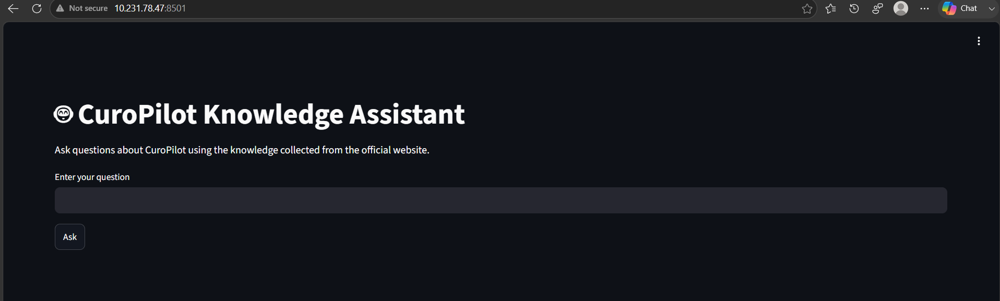
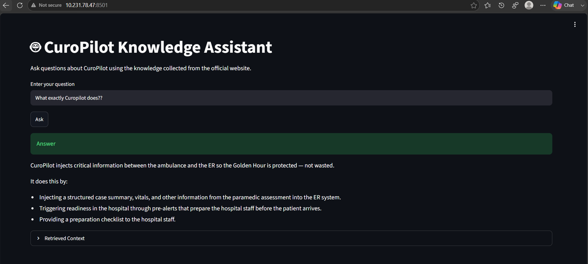
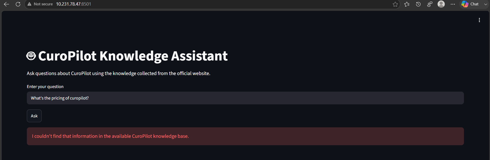
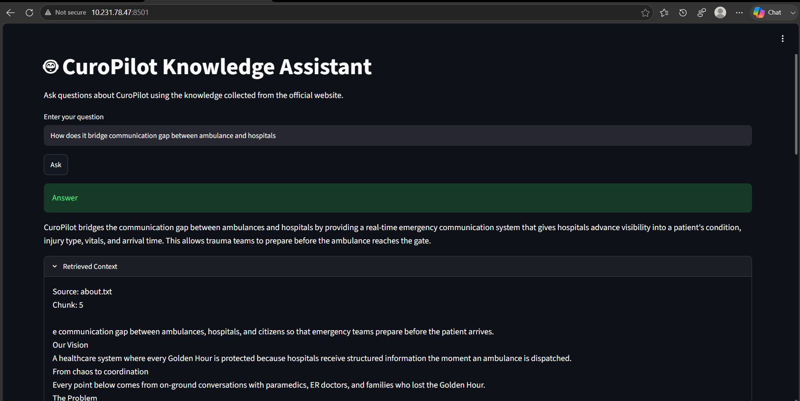

# 🤖 CuroPilot Knowledge-Based AI Assistant

An AI-powered Question Answering System built using a **Retrieval-Augmented Generation (RAG)** architecture. This project collects publicly available information from the CuroPilot website, processes it into a searchable knowledge base, and answers user questions accurately using semantic search and a Large Language Model (LLM).

---

# 📌 Project Overview

The objective of this project is to build a knowledge-based AI assistant capable of answering questions related to **CuroPilot** using only publicly available information available on the official website.

Instead of relying on the language model's general knowledge, the system retrieves relevant information from its own knowledge base and generates answers based only on the retrieved context.

If the requested information is unavailable in the knowledge base, the assistant clearly informs the user instead of generating incorrect or fabricated information.

---

# 🎯 Objectives

* Collect publicly available information from the CuroPilot website.
* Build a searchable knowledge base.
* Implement a Retrieval-Augmented Generation (RAG) pipeline.
* Retrieve relevant information using semantic search.
* Generate accurate answers using an LLM.
* Prevent hallucinations by restricting responses to retrieved content.
* Provide a simple interface for testing the system.

---

# 🚀 Features

* Website crawling
* Automatic content extraction
* Text preprocessing
* Document chunking
* Sentence embedding generation
* FAISS vector database
* Semantic similarity search
* Groq LLM integration
* Streamlit web interface
* Answers restricted to available knowledge
* Modular project architecture

---

# 🛠 Tech Stack

## Programming Language

* Python 3.11+

## Libraries

* Requests
* BeautifulSoup4
* SentenceTransformers
* FAISS
* NumPy
* Streamlit
* Groq Python SDK
* python-dotenv

---

# 📂 Project Structure

```text
curopilot-rag-assistant/

│
├── data/
│   ├── urls.txt
│   ├── extracted/
│   ├── cleaned/
│   ├── chunks/
│   └── embeddings/
│
├── vector_db/
│   ├── faiss_index.bin
│   └── metadata.json
│
├── src/
│   ├── crawler.py
│   ├── extractor.py
│   ├── preprocessor.py
│   ├── chunker.py
│   ├── embeddings.py
│   ├── vectorstore.py
│   ├── retriever.py
│   ├── llm.py
│   └── app.py
│
├── streamlit_app.py
├── requirements.txt
├── .env
├── README.md
└── .gitignore
```

---

# ⚙️ System Architecture

```text
                 Official CuroPilot Website
                           │
                           ▼
                     Website Crawler
                           │
                           ▼
                    URL Collection
                           │
                           ▼
                  Content Extraction
                           │
                           ▼
                   Text Preprocessing
                           │
                           ▼
                    Document Chunking
                           │
                           ▼
                 Embedding Generation
                           │
                           ▼
                  FAISS Vector Database
                           │
                           ▼
                  Semantic Retrieval
                           │
                           ▼
                   Context Construction
                           │
                           ▼
                     Groq LLM
                           │
                           ▼
                 Final Generated Answer
                           │
                           ▼
                    Streamlit Interface
```

---

# 🔄 Workflow

## 1. Website Crawling

The crawler starts from the CuroPilot homepage and discovers all internal links. The discovered URLs are stored in `data/urls.txt`.

---

## 2. Content Extraction

Each URL is downloaded using Requests and parsed using BeautifulSoup. HTML tags, scripts, styles, and unnecessary elements are removed. The extracted text is stored as individual text files.

---

## 3. Text Preprocessing

The preprocessing module removes repeated content such as navigation menus, duplicate lines, excessive whitespace, and unnecessary formatting to create clean documents.

---

## 4. Document Chunking

Clean documents are divided into smaller overlapping chunks. Each chunk contains a manageable amount of text suitable for semantic search.

---

## 5. Embedding Generation

Each chunk is converted into a numerical vector using the SentenceTransformers model:

`sentence-transformers/all-MiniLM-L6-v2`

These vectors capture the semantic meaning of the text.

---

## 6. FAISS Vector Database

Generated embeddings are stored in a FAISS vector index to enable efficient similarity search.

---

## 7. Semantic Retrieval

When a user asks a question:

* The question is converted into an embedding.
* FAISS searches for the most relevant chunks.
* The top matching chunks are retrieved.

---

## 8. Context Construction

Retrieved chunks are combined into a structured context document.

---

## 9. LLM Response Generation

The structured context and user question are sent to the Groq LLM.

The model is instructed to:

* Answer only using the provided context.
* Avoid using external knowledge.
* Inform the user if the answer is unavailable.

---

## 10. User Interface

The Streamlit application provides an interactive interface where users can ask questions and receive AI-generated responses.

---

# 🧠 Embedding Model

Model Used:

```
sentence-transformers/all-MiniLM-L6-v2
```

Reasons for selection:

* Free and open source
* Fast inference
* Lightweight
* High semantic search performance
* Produces 384-dimensional embeddings

---

# 🤖 Large Language Model

Provider:

```
Groq
```

Model:

```
llama-3.1-8b-instant
```

---

# 📊 Vector Database

```
FAISS
```

Used for efficient similarity search over embedding vectors.

---

# 📦 Installation

Clone the repository:

```bash
git clone https://github.com/<nikitakadrame04>/curopilot-rag-assistant.git

cd curopilot-rag-assistant
```

Create a virtual environment:

```bash
python -m venv venv
```

Activate the environment.

Windows:

```bash
venv\Scripts\activate
```

Linux/macOS:

```bash
source venv/bin/activate
```

Install dependencies:

```bash
pip install -r requirements.txt
```

---

# 🔑 Environment Variables

Create a `.env` file in the project root.

```env
GROQ_API_KEY=your_api_key_here
```

---

# ▶️ Running the Project

## Step 1

Discover website URLs.

```bash
python src/crawler.py
```

---

## Step 2

Extract website content.

```bash
python src/extractor.py
```

---

## Step 3

Preprocess extracted text.

```bash
python src/preprocessor.py
```

---

## Step 4

Generate document chunks.

```bash
python src/chunker.py
```

---

## Step 5

Generate embeddings.

```bash
python src/embeddings.py
```

---

## Step 6

Build the FAISS vector database.

```bash
python src/vectorstore.py
```

---

## Step 7

Run the Streamlit application.

```bash
streamlit run streamlit_app.py
```

---

# 💬 Sample Questions

* What is CuroPilot?
* What problem does CuroPilot solve?
* How does CuroPilot improve emergency healthcare?
* Who are the users of CuroPilot?
* What are the main features of CuroPilot?
* How does CuroPilot help hospitals?
* What information is shared between ambulances and hospitals?

---

# 📚 Learning Outcomes

This project demonstrates practical implementation of:

* Information Retrieval
* Retrieval-Augmented Generation (RAG)
* Semantic Search
* Sentence Embeddings
* Vector Databases
* Large Language Models
* Prompt Engineering
* Website Crawling
* Web Scraping
* Knowledge Base Construction
* End-to-End AI Application Development

---

# 📸 Application Screenshots

## Home Screen



---

## Successful Answer



---

## Answer Not Found



---

## Retrieved Context

